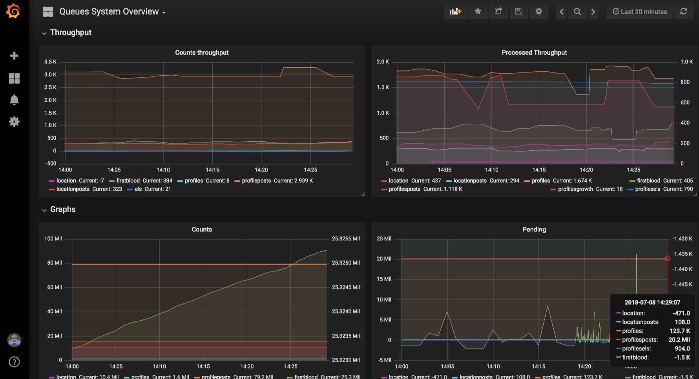

# Fetchq Features

### Multiple distributed workers

The whole point of developing _Fetchq_ was to scale a crowler app that I was working on.

My target website (often in this pages I refer to it as the "superheroes" website) did slow down
their response time and I had to put more servers (with different public IPs) into the job.

I soon found out that by simply picking up a task from a sorted list was not enough. I needed
some sort of exclusive access to it that was resilient to multiple concurrent access.

To date I am using _Fetchq_ in production with ~90 machines pointing to it as single source
of truth for the question "what do I do next?".

### Endless (~) reliable storage

I admit I am no expert in higly available distributed queue systems that do not fail.
I know it is possible to build a custom queue system with a couple of existing open source
solution, but I got to face the hard fact that is expensive in knowledge and infrastructure.

_Postgres_ is a reliabale relational database with a solid set of tools to perform maintenance
operations (backup/restore) that are familiar to most developers. Among _Postgres_ wonderful
internal features I can mention the table namespacing, basically you can route data to specific
logic discs based on the table's name. Wonderful. You can distribute data the way you want to the
disk you want, based on need.

To date my production db is ~700Gb on a relatively small _AWS m4.medium_ instance. There are
~160M documents in it, and I can scale the data storage to multiple discks before I even start
to think to clusterize _Postgres_ itself (which is in the roadmap for _Fetchq_ anyway).

It is ridicolously easy to dump single (or multiple) queues into compressed files and automatically
send them up to _S3_ for long term restorable backup. It doesn't sweat!

### Near real-time metrics

`SELECT COUNT(*)` works only up to few hundred thousand records. Beyond that point you have to build
your own guns.

Much much work went into (and still is) building a solid and reliable metric system that rapresent a
_near real time_ status of your queue. But today you can track your entire system progress through a
set of _Grafana boards_ that give an immediate visual understanding. Cool stuff.

Of course you can also programmatically access any metric, plus you can **track your own metrics as well**.

Say you want to **measure and track how long a piece of code takes to execute**, this is not only doable,
but it integrates seamlessly with the core metrics and you can plot a custom chart for that too.

### Best effort "after" policy

### Errors threshold (with logging)

