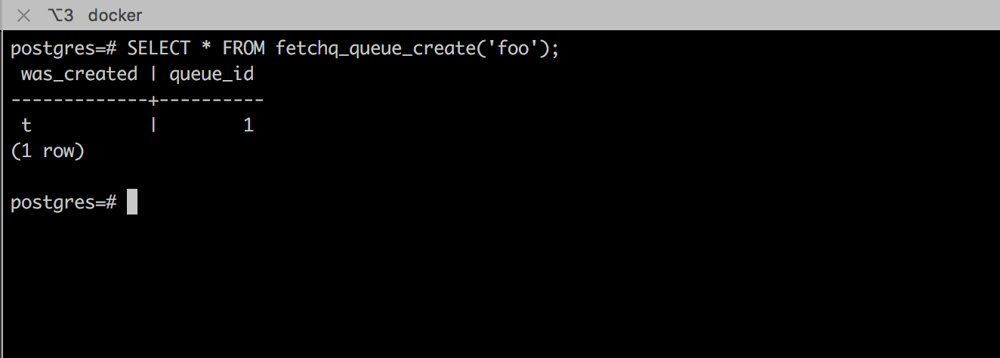

## <small class="new-row">[&laquo; Getting Started](./README.md)</small> 03 Create a new queue

First read:   
[Initialize Fetchq &raquo;](02-initialize-fetchq.md)

---

_Fetchq_ provides you with queues for you to manage few-to-millions documents. Hence your next
step is to _create_ a new queue:

````
SELECT * FROM fetchq_queue_create('foo');
````



This command will _upsert_ a queue. If the queue didn't exist then it's being created; else not
so much is happening, but the command will not fail. You have a boolean indicator that tells
you whether the queue had been created or updated.

**NOTE:** in future versions the "update" mode might trigger reindexing or version migration
schema updates on a specific queue.

If you list the tables again (`SELECT * FROM pg_catalog.pg_tables WHERE schemaname = 'public';`)
you will notice that 3 new tables where created:

* `fetchq__foo__documents` - will store the queue's documents
* `fetchq__foo__errors` - errors will be logged here
* `fetchq__foo__metrics` - timeserie metrics will let you plot the status in time for this queue