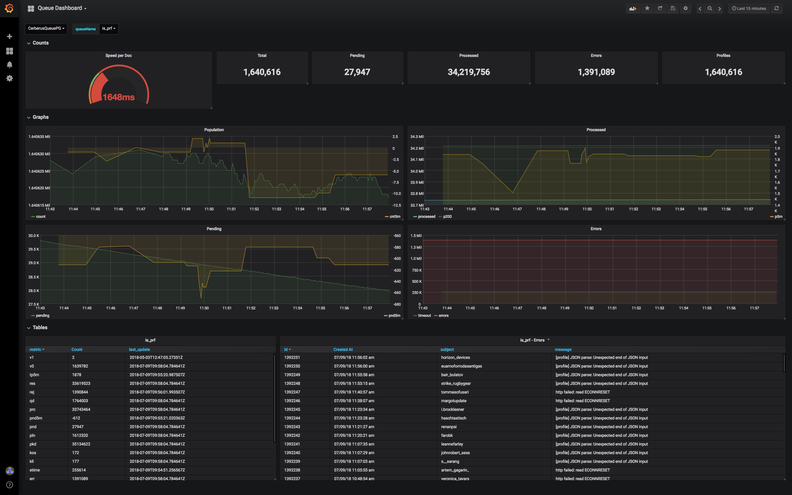
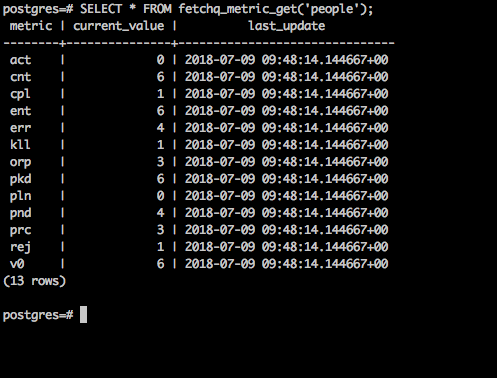

# Metrics

One of the most important features in _Fetchq_ are the metrics, or the ability to
check what is the status of a queue while actively working on it.

Basically you may want to know how many documents do you hace in a particular
queue, how may pending documents and how many errors have been triggered.

More than that you may want to plot a chart to check how one (or more) of this
metrics are changing through time. Data visualization is a very relevant chapter
in handling a multi-million documents data processing project:



_Fetchq_ offers a wide range of functions that helps in gathering different metrics
at different levels of "focus". In this page we will see some basic cases.

## Get a global overview

```
SELECT * FROM fetchq_metric_get_all();
```

This query will provide the latest available values for the core metrics for all the
queues that are available in the database.


**NOTE:** only the core metrics are listed in this table. As you may know already, you can
add unlimited custom metrics to any queue. To read those, look at the next paragraph.

## Get metrics for a specific queue

This query targets a specific queue, but lists all the available metrics, core plus custom ones. And for each metric you have the last update time too.

```
SELECT * FROM fetchq_metric_get('people');
```



